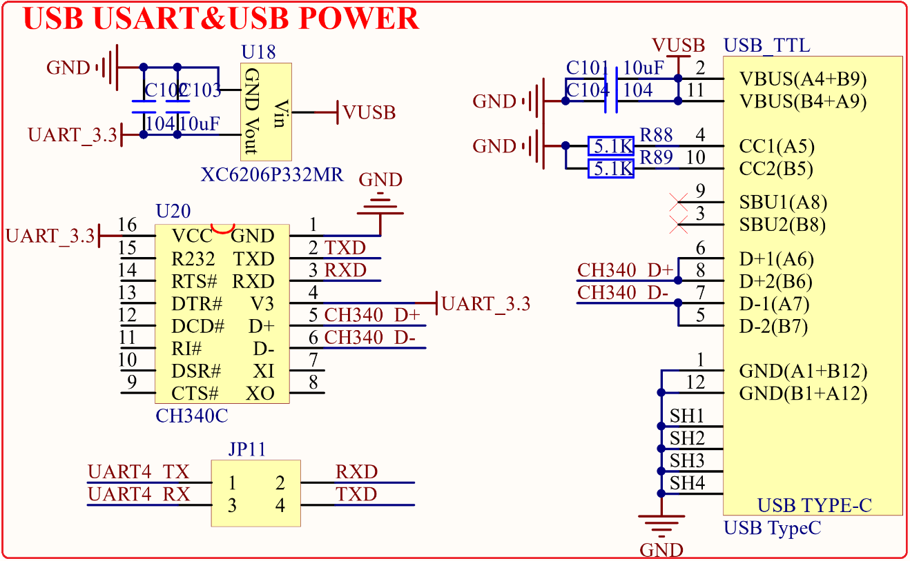

# 1.3.27 USB串口(Type-C接口)     

&emsp;&emsp;STM32MP157开发板板载了一个USB串口，其原理图如图1.3.27.1所示：

 
图1.3.27.1 USB串口

&emsp;&emsp;USB转串口，我们选择的是CH340C，是国内芯片公司南京沁恒的产品，稳定性非常不错所以还是多支持下国产。CH340C内置晶振，因此就不需要再在外面连接一个晶振。图中可以看出CH340C的电源为3.3V，并且是独立供电的，U18是一个LDO芯片，负责给CH340C提供3.3V的电源。CH340C的电源不受开发板电源开关控制，只要接上USB线CH340就会上电。图中RXD/TXD接JP5的RXD/TXD，是CH340芯片的串口接收和发送脚，可以通过跳线帽连接到STM32MP157的串口4上。

&emsp;&emsp;USB_TTL是一个USB Type-C座，提供CH340C和电脑通信的接口，同时可以给开发板和CH340C供电，VUSB就是来自电脑USB的电源，USB_TTL是本开发板的主要供电口。

