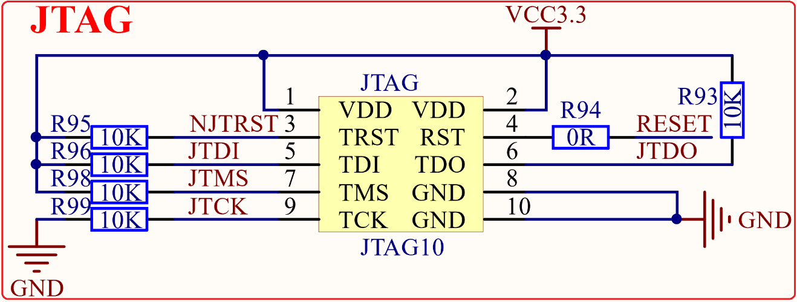

# 1.3.28 JTAG/SWD接口   

&emsp;&emsp;STM32MP157开发板板载一个10针，2.0mm间距的JTAG接口，用于调试STM32MP157的M4内核，原理图如图1.3.28.1所示：

 
图1.3.28.1 JTAG/SWD接口

&emsp;&emsp;这里，我们采用的是10针、2.0mm的JTAG接法（支持SWD），但是STM32MP157还有SWD接口，SWD只需要最少2根线（SWCLK和SWDIO）就可以调试代码了，所以建议大家在设计产品的时候，可以留出SWD来下载调试代码，而摒弃JTAG。STM32MP157的SWD接口与JTAG是共用的，只要接上JTAG，你就可以使用SWD模式了（其实并不需要JTAG这么多线），当然，你的调试器必须支持SWD模式，JLINK(**必须是V9或者以上版本**)、ULINK2和ST LINK等都支持SWD调试。

