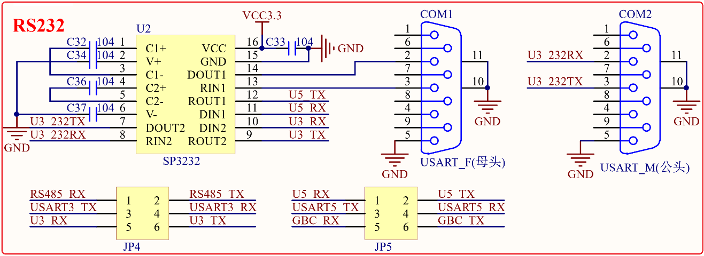

# 1.3.8 RS232串口

&emsp;&emsp;STM32MP157开发板板载了2个RS232接口，1个公头，1个母头，电路原理图如图1.3.8.1所示：

 
图1.3.8.1 RS232串口

&emsp;&emsp;因为RS232电平不能直接连接到STM32MP157，所以需要一个电平转换芯片。这里我们选择的是SP3232（也可以用MAX3232）来做电平转接，一片SP3232可以转两路RS232。同时图中的JP4用来实现RS232(母头)/RS485的选择，JP5用来实现RS232(公头)/ATK模块的选择。所以RS232(母头)/RS485都是通过串口3来实现的，RS232(公头)/ATK模块都是通过串口5来实现的。

