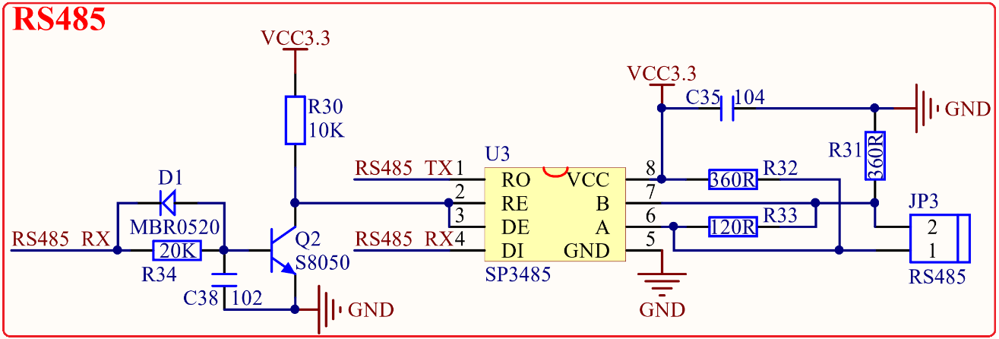

# 1.3.9 RS485接口

&emsp;&emsp;STM32MP157开发板板载的RS485接口电路如图1.3.9.1所示：

 
图1.3.9.1 RS485接口

&emsp;&emsp;RS485电平也不能直接连接到STM32MP157，同样需要电平转换芯片。这里我们使用SP3485来做485电平转换，其中R33为终端匹配电阻，而R31和R32则是两个偏置电阻，以保证静默状态时485总线维持逻辑1。

&emsp;&emsp;RS485_RX/RS485_TX连接在JP4上面，通过JP4跳线来选择是否连接在STM23MP157上面，SP3485的RE引脚连接通过一系列的电路连接到了RS485_RX引脚上，这样就可以通过RS485_RX引脚来控制RS485的接收和发送状态，完全将RS485当做一个串口来使用。

