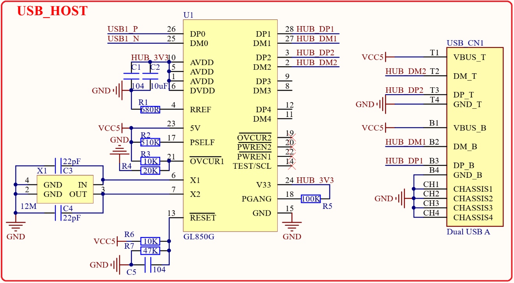

# 1.4.10 USB HUB接口

&emsp;&emsp;正点原子STM32MP157-Mini开发板板载了一颗一扩4的USB HUB芯片，用于将STM32MP157的USB1扩展为4个USB HOST接口(STM32MP157-Mini开发板实际只接了2个USB HOST接口)，如图1.4.10.1所示：

 
图1.4.10.1 USB HUB接口电路

&emsp;&emsp;STM32MP157带有两个USB接口，但是对于Linux应用来说两个USB太少了，如果我们要连接鼠标、键盘、U盘等设备的时候两个USB口完全不够用。因此STM32MP157-Mini开发板通过GL850G芯片将STM32MP157的USB1外扩出了2个USB HOST接口(GL850G可以扩展出4路，这里只扩展出了2路)。这2个USB HOST接口通过1个双层USB A座提供，图1.4.10.1中USB_CN1就是这个双层USB A座。

