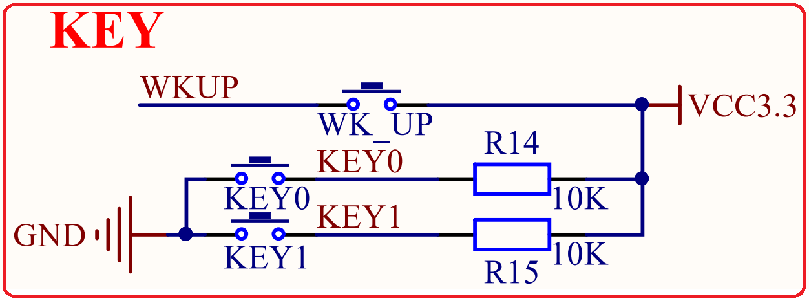

# 1.4.13 按键 

&emsp;&emsp;STM32MP157-Mini开发板板载3个输入按键，其原理图如图1.4.13.1所示：

 
图1.4.13.1 输入按键

&emsp;&emsp;WK_UP、KEY0和KEY1都可以用作普通按键输入，这三个按键分别连接STM32MP157的PA0、PG3和PH7引脚上。WK_UP按键按以后为高电平，KEY0和KEY1这两个按键按下以后为低电平。

