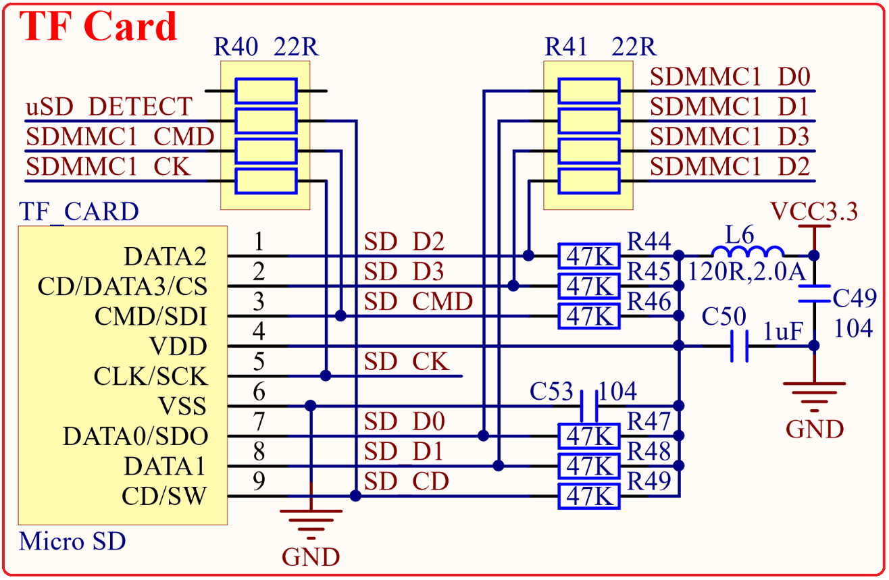

# 1.4.16 TF卡接口  

&emsp;&emsp;正点原子STM32MP157开发板板载了一个TF卡（小卡）接口，其原理图如图1.4.16.1所示：

 
图1.4.16.1 TF卡接口 

&emsp;&emsp;图中TF_CARD为TF卡接口，TF卡采用4位SDMMC方式驱动，非常适合需要高速存储的情况。图中：SDMMC1_D0~D3/SDMMC1_CK/SDMMC_CMD分别连接在STM32MP157的PC8、PC9、PC10、PC11、PC12和PD2引脚上。 uSD_DETECT是TF卡检测引脚，用于检测TF卡插拔过程，连接到STM32MP157的PD10引脚上。

