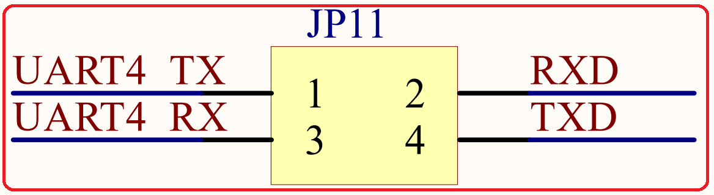

# 1.4.3 USB串口/串口4选择接口 

&emsp;&emsp;STM32MP157开发板板载的USB串口和STM32MP157的串口是通过JP11连接起来的，如图1.4.3.1所示：

 
图1.4.3.1 USB串口/串口4选择接口

&emsp;&emsp;图中TXD/RXD是相对CH340C来说的，也就是USB串口的发送和接收脚。而UART4_RXD和UART4_TXD则是相对于STM32MP157来说的。这样，通过跳线帽将UART4_TX与RXD、UART4_RX与TXD连接起来，就可以实现USB串口和STM32MP157的串口通信了。

