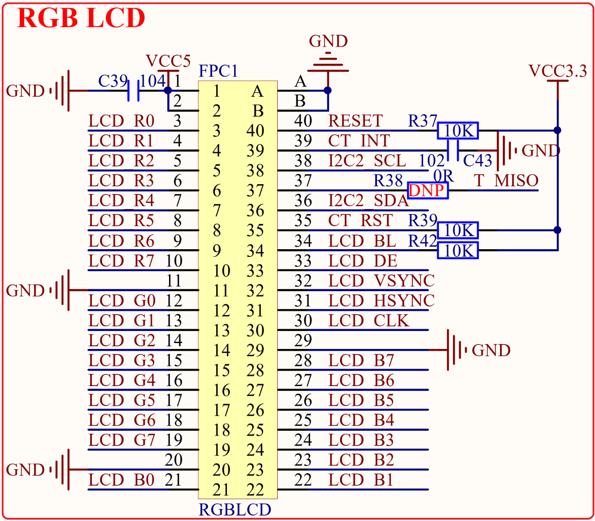

# 1.4.4 RGB LCD模块接口

&emsp;&emsp;STM32MP157底板载了RGB LCD接口，此部分电路如图1.4.4.1所示：

 
图1.4.4.1 RGB LCD接口

&emsp;&emsp;图中，RGBLCD就是RGB LCD接口，采用RGB888数据格式，并支持触摸屏（支持电阻屏和电容屏）。该接口仅支持RGB接口的液晶（不支持MCU接口的液晶），目前正点原子的RGB接口LCD模块有：4.3寸（ID:4342，480*272和ID:4384，800*480）、7寸(ID:7084，800*480和ID:7016，1024*600)和10寸(ID:1018，1280*800)等尺寸可选。 

&emsp;&emsp;图中的I2C2_SCL和I2C2_SDA为I2C2的两根数据线，分别连接到PH4和PH5这两个IO上。LCD_BL是LCD的背光控制IO，连接在STM32MP157的PD13上，用于控制LCD的背光。液晶复位信号RESET则是直接连接在开发板的复位按钮上，和STM32共用一个复位电路。

