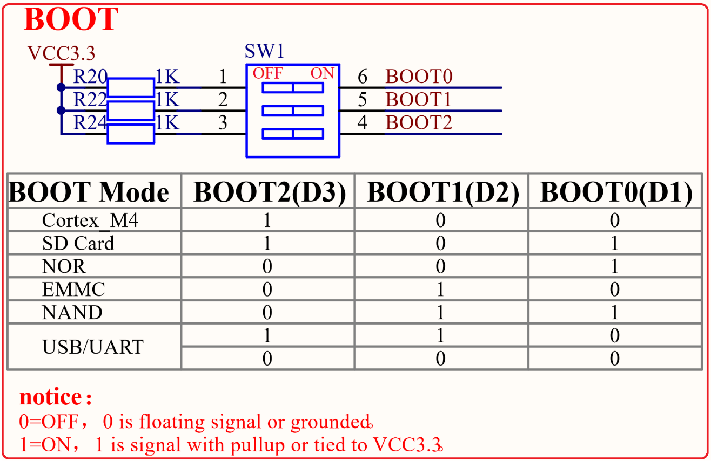

# 1.4.6 启动模式设置接口

&emsp;&emsp;STM32MP157开发板的启动模式设置端口电路如图1.4.6.1所示：

 
图1.4.6.1 启动模式设置接口

&emsp;&emsp;STM32MP157支持从多种不同的设备启动，通过设置拨码开关可以选择从指定的设备启动，启动方式如表1.4.6.1所示：

<table class="stm32mp157_center-table">
  <tr>
    <th>BOOT0(D1)</th>
    <th>BOOT1(D2)</th>
    <th>BOOT2(D3)</th>
    <th>启动模式</th>
  </tr>
  <tr>
    <td>0</td>
    <td>0</td>
    <td>1</td>
    <td>启动M4内核</td>
  </tr>
  <tr>
    <td>1</td>
    <td>0</td>
    <td>1</td>
    <td>SD卡启动</td>
  </tr>
  <tr>
    <td>1</td>
    <td>0</td>
    <td>0</td>
    <td>NOR启动</td>
  </tr>
  <tr>
    <td>0</td>
    <td>1</td>
    <td>0</td>
    <td>EMMC启动</td>
  </tr>
  <tr>
    <td>1</td>
    <td>1</td>
    <td>0</td>
    <td>NAND启动</td>
  </tr>
  <tr>
    <td>0</td>
    <td>1</td>
    <td>1</td>
    <td>USB/UART启动</td>
  </tr>
  <tr>
    <td>0</td>
    <td>0</td>
    <td>0</td>
    <td>USB/UART启动</td>
  </tr>
</table>

&emsp;&emsp;正点原子STM32MP157开发板上支持USB、SD卡、EMMC以及M4内核这4种启动方式。

