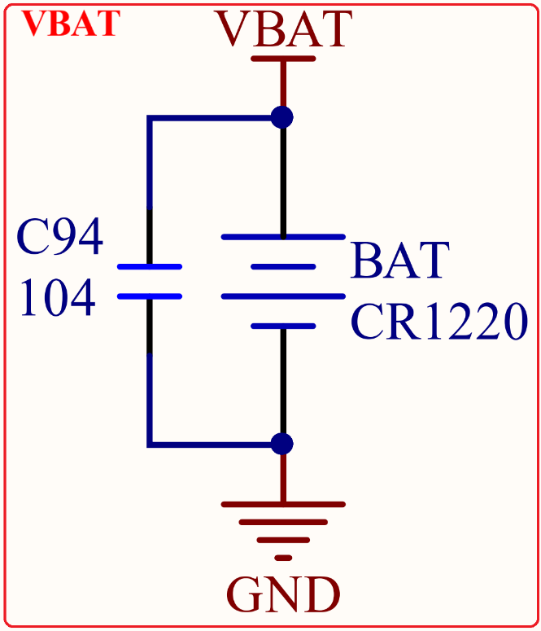
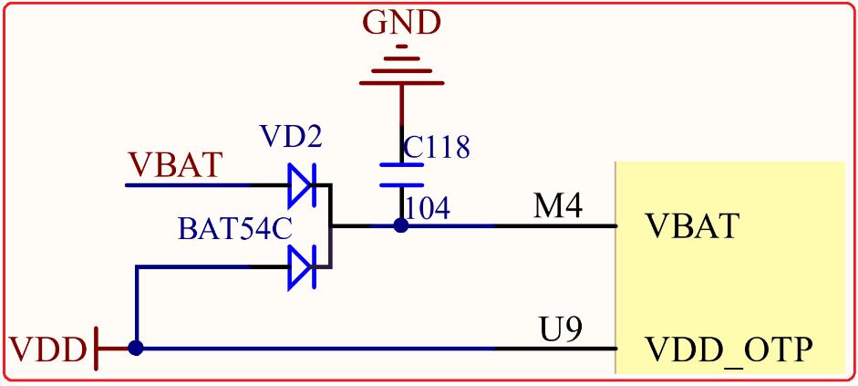

# 1.4.7 VBAT供电接口

&emsp;&emsp;STM32MP157开发板的VBAT供电电路如图1.4.7.1所示：

 
图1.4.7.1 VBAT供电接口

&emsp;&emsp;上图的VBAT通过核心板上的BAT54C，连接到STM32MP157的VBAT(M4)引脚上，从而给核心板的后备区域供电。这部分原理图在核心板上，如图1.4.7.2所示：

 
图1.4.7.2 核心板VBAT供电原理图

&emsp;&emsp;如图1.4.7.2所示，VBAT引脚使用VBAT（接CR1220电池）和VDD混合供电的方式，在有外部电源（VDD）的时候，CR1220不给VBAT供电，而在外部电源断开的时候，则由CR1220给其供电。这样，VBAT总是有电的，以保证RTC的走时。

