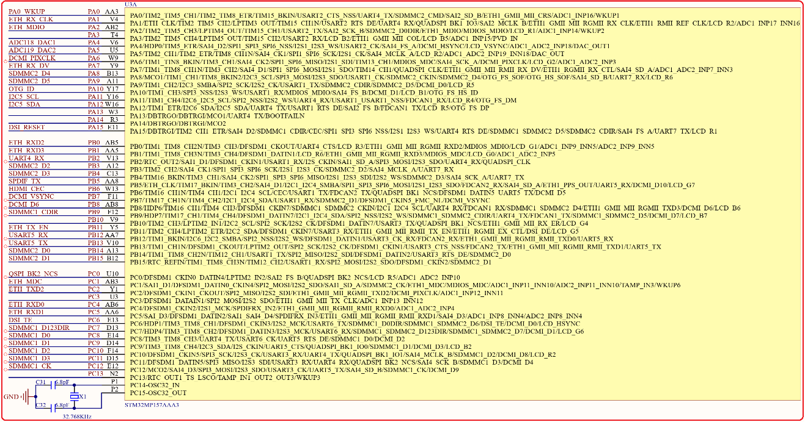
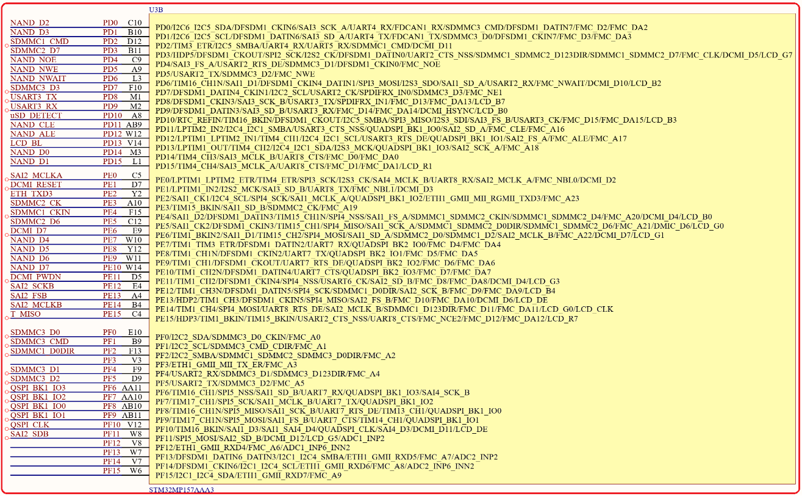
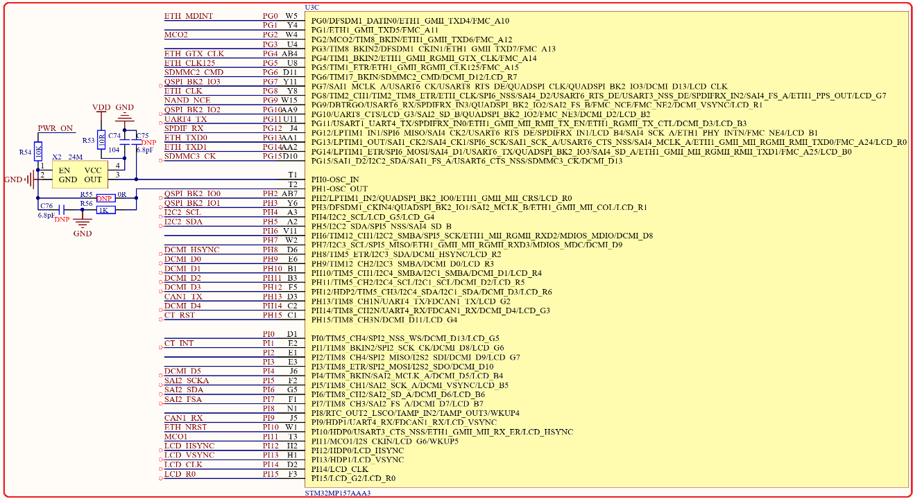
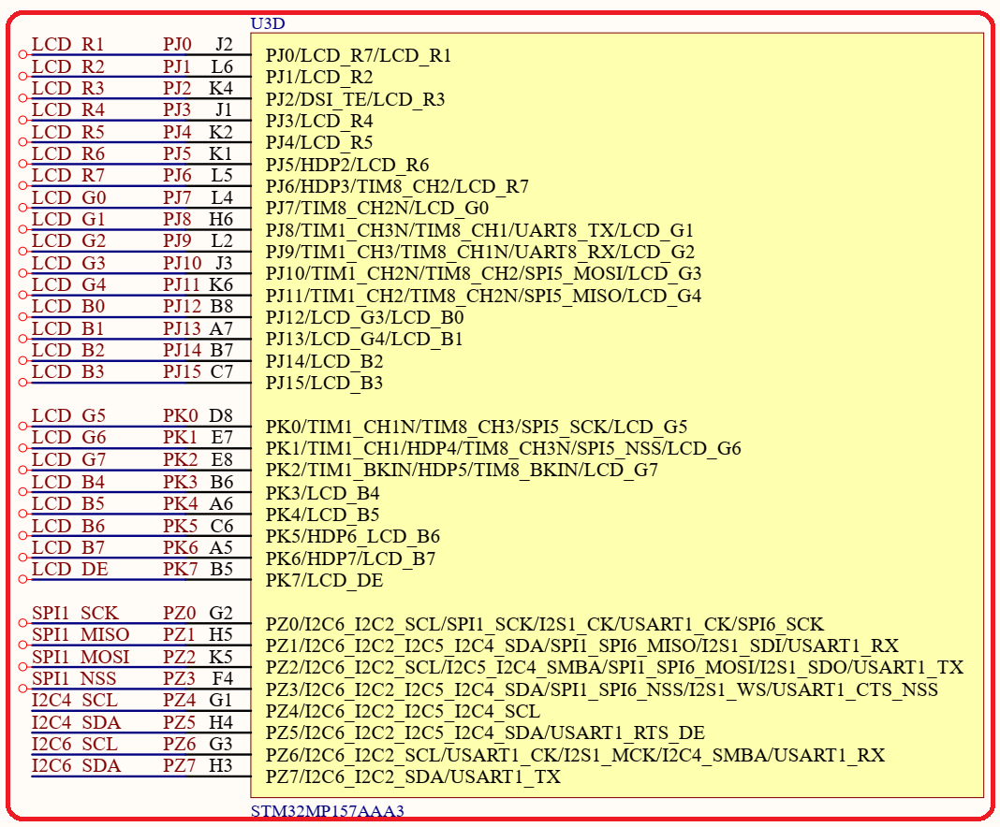
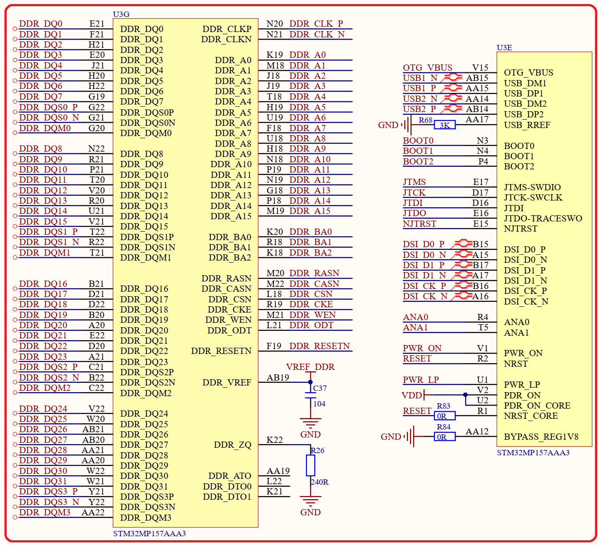
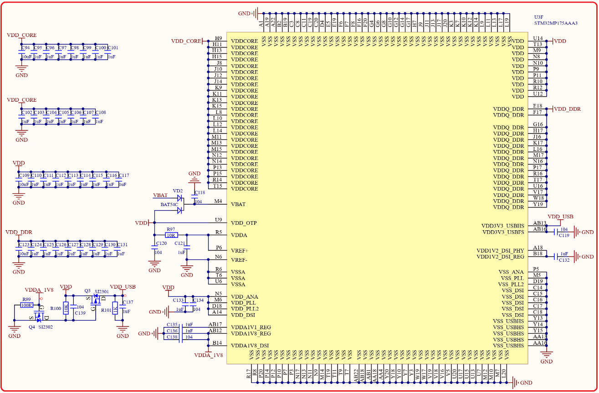

# 1.5.1 SOC  

&emsp;&emsp;STM32MP157开发板配套的STM32MP157核心板，采用STM32MP157DAA1作为主控CPU，双核A7(800M)+单核M4(209M)。自带32KB的L1指令和数据Cache、256KB的L2 Cache，集成NEON和TrustZone，集成3D GPU、集成双精度硬件浮点计算单元VFPv4，并具有708KB SRAM、2个高级定时器、10个通用定时器、2个基础定时器、5个低功耗定时器、2个CRC、一个FMC接口、1个QUADSPI接口、2个ADC外设、1个内嵌的数字温度传感器、2个DAC外设、1个DFSDM外设、1个DCMI接口、1个RGB LCD控制器(LTDC)、1个MIPI LCD接口(MIPI)、2个RNG、1个内嵌RTC、8个UART/USART、6个SPI、4个SAI、1个SPDIF外设、1个千M网络MAC控制器、2个USB控制器、3个SDMMC接口、2个FDCAN接口等。 

&emsp;&emsp;SOC部分的原理图如图5.5.1.1~图5.5.1.5（因为原理图比较大，缩小下来可能有点看不清，请大家打开开发板光盘的原理图进行查看）所示：

 
图1.5.1.1 SOC部分原理图1

 
图1.5.1.2 SOC部分原理图2

 
图1.5.1.3 SOC部分原理图3

 
图1.5.1.4 SOC部分原理图4

 
图1.5.1.5 SOC部分原理图5

 
图1.5.1.6 SOC部分原理图6

&emsp;&emsp;STM32MP157芯片的原理图由6个部分组成，接下来依次看一下这6部分的具体内容： 
&emsp;&emsp;图1.5.1.1：此部分原理图主要是STM32MP157的GPIOA~C这部分IO原理图。 
&emsp;&emsp;图1.5.1.2：此部分原理图主要是STM32MP157的GPIOD~F这部分IO原理图。 
&emsp;&emsp;图1.5.1.3：此部分原理图主要是STM32MP157的GPIOG~I这部分IO原理图。 
&emsp;&emsp;图1.5.1.4：此部分原理图主要是STM32MP157的GPIOJ~Z这部分IO原理图。 
&emsp;&emsp;图1.5.1.5：此部分原理图是STM32MP157的DDR以及USB、JTAG、DSI等外设引脚。 
&emsp;&emsp;图1.5.1.6：此部分原理图是STM32MP157的电源部分。

