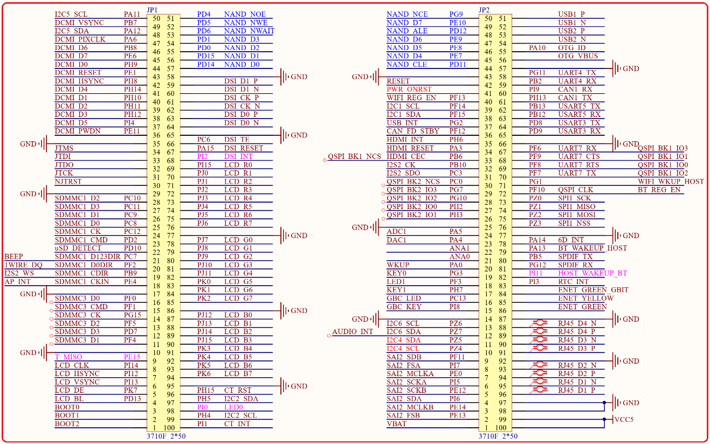

# 1.5.2 BTB接口 

&emsp;&emsp;STM32MP157核心板采用2个2*50的3710M（母座）板对板连接器来同底板连接(在转接板底面)，接插非常方便，转接板上面的底板接口原理图如图1.5.2.1所示：

 
图1.5.2.1 底板接口

&emsp;&emsp;图中，JP1和JP2是2个2*50的板对板母座（3710M），和底板的接插非常方便，方便大家嵌入自己的项目中去。该接口总共引出144个IO口，另外，还有USB、电源、复位、ONOFF等信号。

