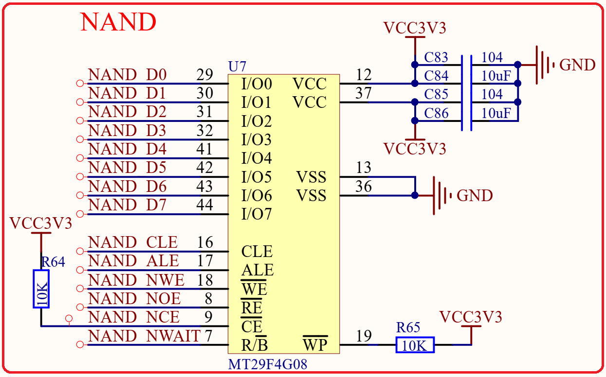

# 1.5.3 NAND FLASH

&emsp;&emsp;STM32MP157核心板支持NAND，如果有需要话可以焊接一片 NAND Flash上去，此部分电路如图1.5.3.1所示：

 
1.5.3.1 NAND Flash

&emsp;&emsp;Linux系统需要一个存储数据和系统的存储芯片，比如QSPI Flash、NAND Flash、EMMC等。正点原子的STM32MP157核心板硬件上支持NAND和EMMC这两种存储芯片，图1.5.3.1中的是NAND Flash的原理图。

