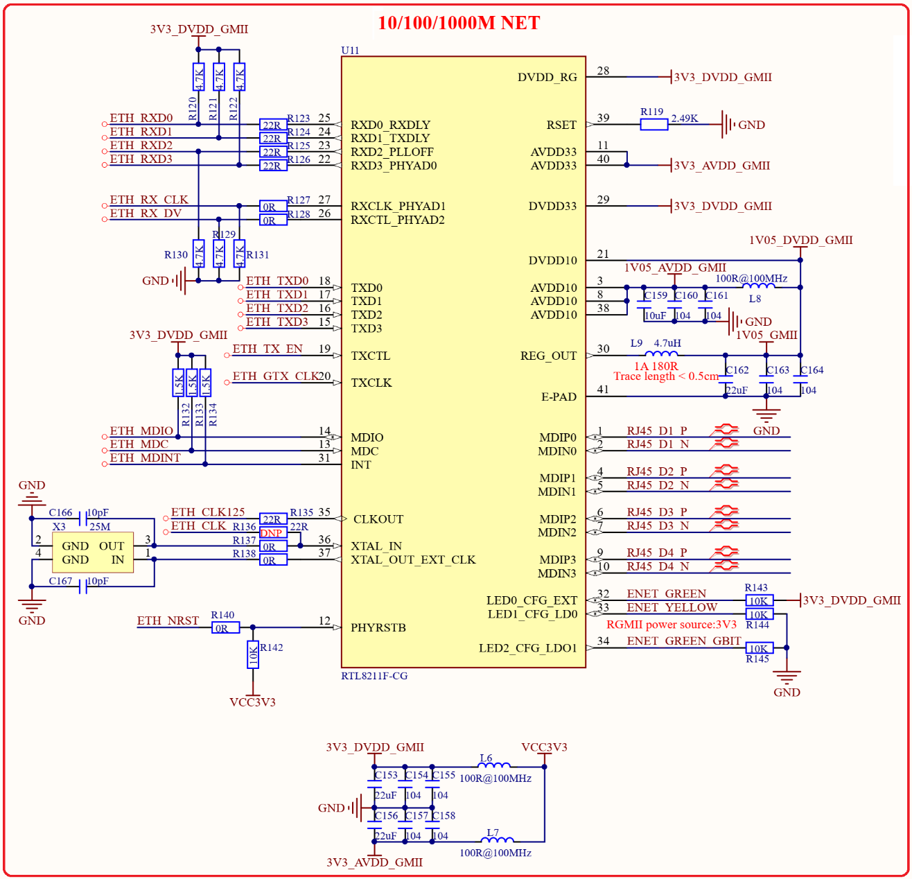

# 1.5.6 千M以太网PHY

&emsp;&emsp;STM32MP157核心板板载一个千M以太网PHY，方便用户制作底板，原理图如图1.5.6.1所示：

 
图1.5.6.1 千M以太网原理图

&emsp;&emsp;图1.5.6.1中U11是千M网络PHY芯片RTL8211F-CG，连接到STM32MP157的网络外设上，最终提供RJ45_D1_P~RJ45_D4_N、ENET_GREEN、ENET_YELLOW和ENET_GREEN_GBIT这11根信号线。

