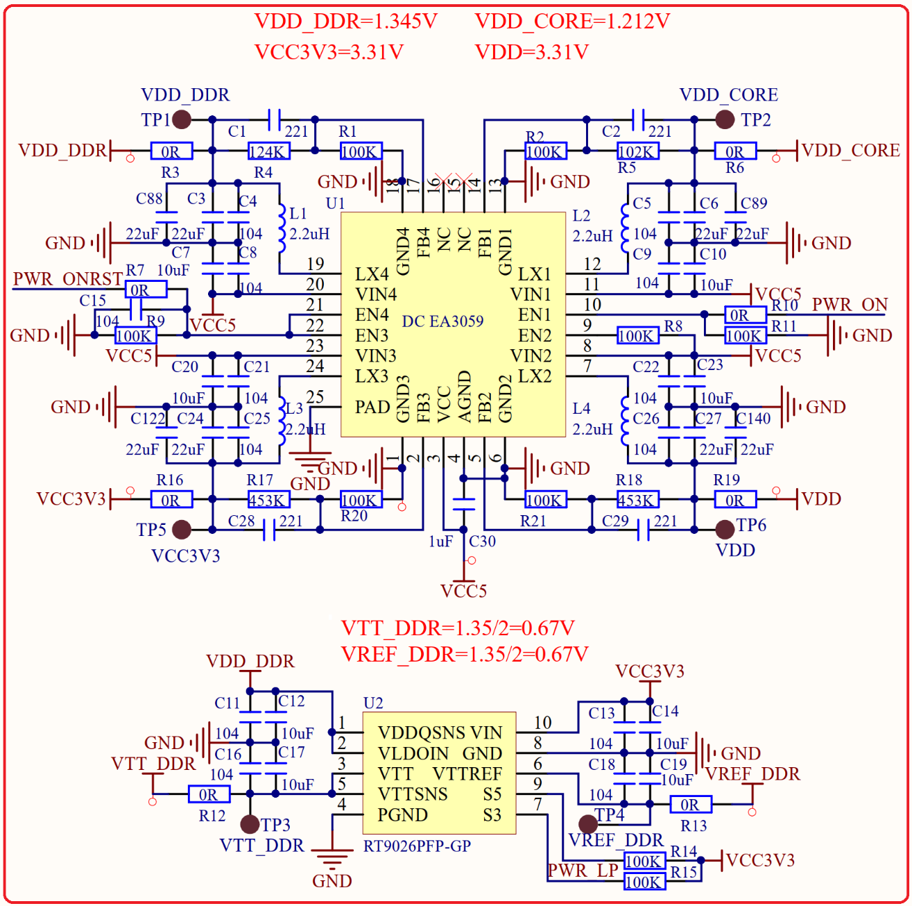

# 1.5.7 核心板电源 

&emsp;&emsp;STM32MP157对于供电有严格的要求，尤其是上电顺序，上电顺序部分参考《STM32MP1分立电源硬件集成设计指南.pdf》。核心板供电主要分6部分：VCC3V3供电、VDD供电、VDD_CORE内核供电、VDD_DDR内存供电、VTT_DDR端接电压、VREF_DDR参考电压，整个核心板供电电源如图1.5.7.1所示：

 
图1.5.7.1 核心板电源

